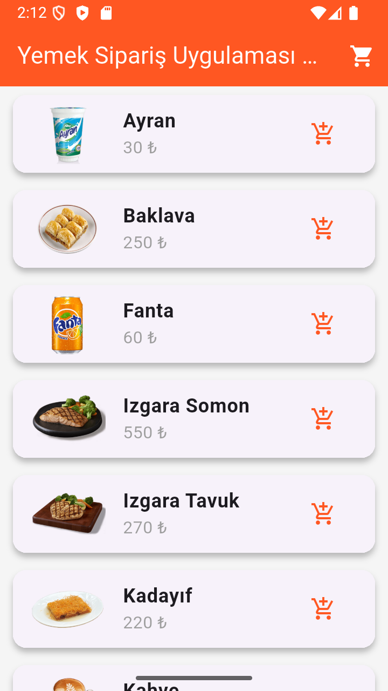
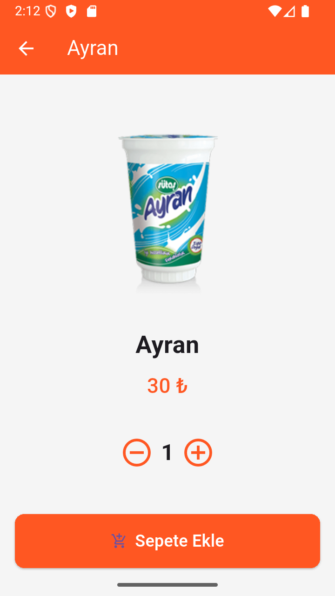
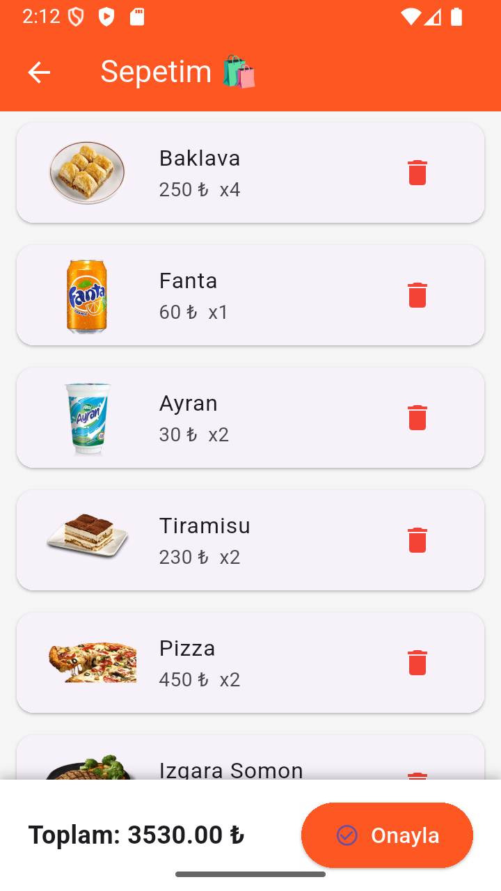

# 🍔 YemekSiparisApp

Flutter ile geliştirilen modern bir yemek sipariş uygulaması.  
Kullanıcılar menüdeki ürünleri görüntüleyebilir, detay sayfasına gidebilir ve sepete ekleme işlemi yapabilirler.

## 🚀 Özellikler
- Ürün listeleme  
- Ürün detay görüntüleme  
- Sepete ekleme ve silme  
- Toplam tutar hesaplama  
- Kullanıcı dostu arayüz  

## 📸 Ekran Görüntüleri

| Ana Sayfa | Ürün Detayı | Sepet |
|------------|--------------|--------|
|  |  |  |

## 🛠️ Kullanılan Teknolojiler
- Flutter  
- Dart  

## 👤 Geliştirici
**Harun Mercan**  
[GitHub Profilim](https://github.com/HarunMercan1)

Sürüm 2.0
