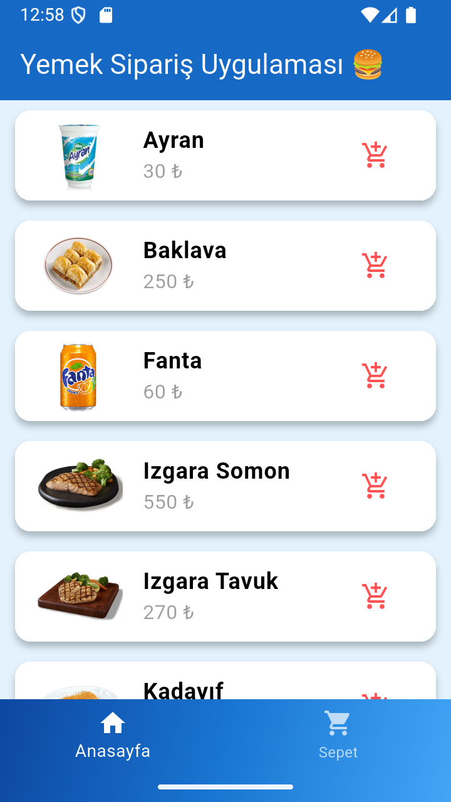
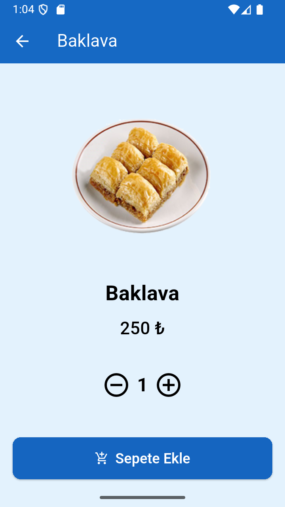
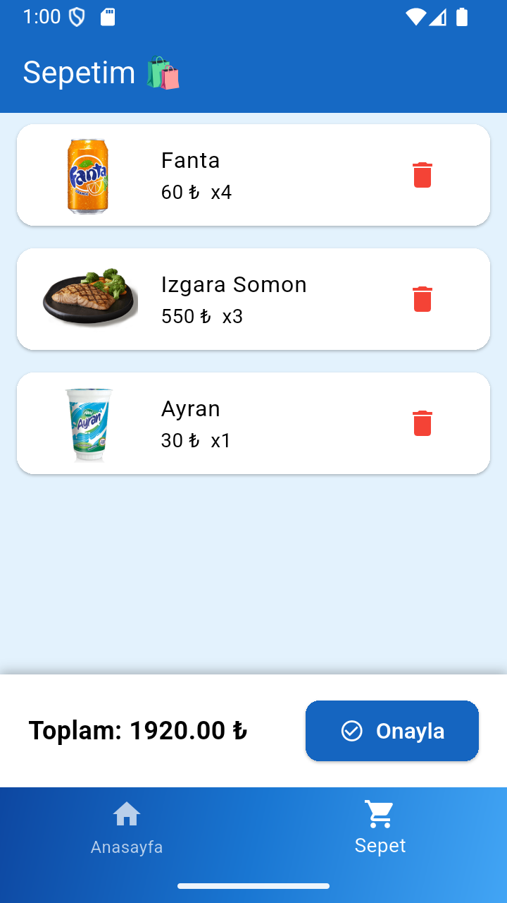

# 🍽️ Yemek Sipariş Uygulaması v2.1.2

Bu proje, **Flutter** framework’ü kullanılarak geliştirilmiş bir **Yemek Sipariş Mobil Uygulamasıdır.**  
Uygulama gerçek bir REST API üzerinden yemek verilerini çeker, kullanıcıların ürünleri sepete eklemesine, sepeti görüntülemesine ve sipariş işlemini tamamlamasına olanak tanır.

---
## 🚀 Özellikler

✅ **BLoC Pattern (State Management):**  
Uygulama, iş mantığı katmanını (Business Logic) arayüzden tamamen ayırmak için BLoC yapısı kullanır.

✅ **Gerçek REST API Entegrasyonu:**  
Veriler [Kasim Adalan Yemekler API](http://kasimadalan.pe.hu/yemekler/) üzerinden alınır.

✅ **Dinamik Yemek Listeleme:**  
API’den gelen veriler anasayfada kartlar halinde listelenir.

✅ **Yemek Detay Sayfası:**  
Kullanıcılar seçtikleri yemeğin detaylarını görüntüleyebilir ve adet belirleyerek sepete ekleyebilir.

✅ **Sepet Yönetimi:**  
- Ürünleri sepete ekleme 🛒  
- Ürün silme ❌  
- Aynı ürünleri gruplama (örnek: Ayran ×2)  
- Toplam tutar hesaplama 💰  

✅ **Mavi Temalı Modern Arayüz:**  
Tamamen özel tema ile tasarlanmış sade ve modern bir kullanıcı arayüzü (AppBar, Navigation Bar, Butonlar).

✅ **Bottom Navigation Bar:**  
Alt menüde Anasayfa ve Sepet sekmeleri arasında kolay geçiş.

✅ **SnackBar Bildirimleri:**  
Kullanıcı işlemleri sonrası bilgilendirici mesajlar.

---

## 🧱 Proje Mimarisi

Proje, **Clean Architecture + BLoC Pattern** prensiplerine göre yapılandırılmıştır.

## 📸 Ekran Görüntüleri

| Ana Sayfa | Ürün Detayı | Sepet |
|------------|--------------|--------|
|  |  |  |

---

## 💡 Kullanılan Teknolojiler

| Teknoloji | Açıklama |
|------------|-----------|
| **Flutter** | Arayüz ve genel uygulama yapısı |
| **Dart** | Programlama dili |
| **BLoC Pattern** | State management yapısı |
| **Dio** | API istekleri için HTTP client |
| **Kasım Adalan API** | REST veri kaynağı |
| **Material Design** | UI bileşenleri |

---

## ✨ Geliştirici

👨‍💻 Harun Reşit Mercan

Gazi Üniversitesi Bilgisayar Mühendisliği

Flutter Developer

